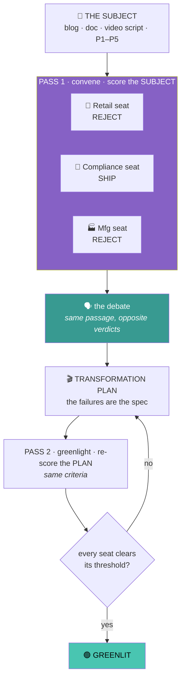

# The Greenlight

**Owner:** Darrin Hanson · **Scenario:** Slide 9, Content & Insights · **Alternate take on Scenario 2**
**Constraints:** 2 hours · ~500–600 people · mixed-skill teams · most seeing these tools for the first time

> **This is a skilling event first and a useful hack second.** Every phase exists because it teaches a transferable AI capability. The content problem is the vehicle. Where *The Critic* teaches a single audience **lens**, *The Greenlight* teaches **multi-agent orchestration** — a council of audiences that scores, debates, and decides. **Run one or the other; they are separate.**

---

## The business problem

| | |
|---|---|
| **Where we are** | Agents write content. Evals check whether it's accurate, clear, and roughly the right level. **They pass almost everything.** |
| **What's missing** | Those evals review with **one implied reader** — an average of everyone, a person who exists nowhere. Competent content aimed at the wrong reader passes every time, because there's no second reader to disagree. |
| **The evidence** | Four blind passes of the solo critic over five pieces. **Not one flagged `P4` as a reject** — a governance whitepaper filed against a store lead. One verdict cannot say *"SHIP for Compliance, REJECT for Retail,"* so it averaged them and missed. |
| **The ask** | *"Persona-lization"* — content evaluated and adapted for specific audiences: their industry, role, authority, experience, time, and **how they actually learn.** Here, by seating those audiences as a council and letting them decide together. |

### The brief

> **One reviewer has one point of view. Real content serves many audiences at once.**
> **Seat the room. Let every audience score it against *their* outcome — and decide, together, what to build.**

---

## The core mechanic

Two passes, one rubric.

**Pass 1** scores the subject from every seat — the verdicts diverge on purpose. **The debate** surfaces the conflicts, evidence-bound. **The plan** derives per-audience assets from the failures (including *"wrong format entirely"*). **Pass 2** re-scores the plan against the same council — the seat that rejected the original must pass its replacement. *The council that vetoes is the council that clears.*

---

## The two rules that govern everything

| | Rule | Why |
|:---:|---|---|
| 🎯 | **A criterion is a bar that protects one audience's outcome** | Not *"is it good?"* — *"will this get **my** people to the result they need?"* If a criterion would score the same for any audience, it's the solo critic's, not a seat's. This is what forces the room to disagree. |
| 🧾 | **No claim without evidence, a source, and a confidence** | Every score quotes the text that caused it, names what backs it (a card line, a rule, a URL, or `UNVERIFIED`), and rates its own certainty. `Low` on a fatal criterion abstains rather than guesses. A confident seat with no source is the failure this scenario kills. |

---

## What's provided

### 1. The Greenlight — one install, five verbs

| Verb | What it does | Who edits it |
|---|---|---|
| `next` | 🧭 **Guide** — what now, am I done | nobody |
| `seat` | 🎤 **Seat an audience** — names its outcome, nominates its criteria | nobody |
| `solo` | ⚖️ **The solo critic** — one implied reader, already scored on all five | **nobody** |
| `convene` | 🎞️ **Pass 1** — every seat scores the subject, then the room debates | nobody |
| `greenlight` | 🟢 **Pass 2** — transformation plan, then re-score to greenlight | nobody |

**Participants only ever edit `THE-COUNCIL.md`** — the roster and its nominated criteria.

> ### ⚠️ Don't edit the solo critic. Build the council next to it.
> It's the before/after. The solo critic returns one verdict per piece; the council returns one per seat. Keep it untouched and teams get to say: *"the solo critic said REVISE for everyone. The council said REJECT for Retail and SHIP for Compliance — same piece. Here are the quotes."*

### 2. The data pack *(shared with Scenario 2)*

| | |
|---|---|
| **5 content pieces** | Learn unit · how-to · blog announcement · exec summary · quickstart. All about Copilot summarization in Teams. |
| **4 audience cards** | Contoso Group: 🛒 Retail · 🏦 Financial · 🏥 Health · 🏭 Manufacturing. The seats of the council. |
| **Style guide** | One page. |
| **Solo critic scores** | Already run. The one-verdict baseline the council improves on. |

---

## The build-out — same rungs, three paths

The features are the same whichever tool you're in. **How you build each one is your path's tail.**

| | Feature you add | ⚡ Skill it teaches |
|:---:|---|---|
| **v0** | *Solo critic* — provided, already scored | — |
| **v1** | **Seat the council.** ≥ 2 audiences, each nominates criteria tied to its outcome | Multi-persona conditioning · criteria-with-anchors · grounding |
| **v2** | **The debate.** Seats score with evidence + source + confidence, react to each other, abstain when unsure | Multi-agent orchestration · adversarial cross-talk · calibrated uncertainty |
| **v3** | **Transformation plan + greenlight.** Derive per-audience assets from the failures; re-score them on the same criteria | Eval → generation loop · closing the greenlight |
| **v4** | **Automate.** Convene on a new subject unattended; the plan lands where people are | Triggers · unattended orchestration · routing |
| **v5** | **Swap the roster.** Someone runs the room with their own audiences | Reusable multi-agent artifacts · agents that produce agents |
| **v6** | **Coverage matrix.** Every piece × every seat — who's served, who's abandoned | Orchestration at scale · gap analysis · structured output |
| **v7** | **The greenlight gate.** Nothing ships until every seated audience clears threshold | Consensus gating · publish-time integration |

### The same rung in three tools

| | 🟢 **BASE** — Cowork | 🔵 **BUILDER** — Microsoft Scout | 🟣 **ADVANCED** — VS Code · GitHub Copilot |
|---|---|---|---|
| **v1 Seat** | Ask Cowork to voice 2–3 seats in turn from the cards, writing each into `THE-COUNCIL.md` | Seat the audiences in `THE-COUNCIL.md`; the skill runs in Scout | Parallel persona agents emitting structured per-seat scorecards |
| **v2 Debate** | The seats "respond to what the others said," you moderate; each cites a quote + source | Convene the skill in Scout; the seats split, each with a quote + source | Orchestrator fans out, a judge agent diffs positions, abstention on low confidence |
| **v3 Plan + greenlight** | Room agrees the plan; re-reads each asset's spec to confirm it clears | The skill greenlights — a per-audience plan, re-scored | Pipeline emits the plan, generates asset outlines, re-runs the rubric |
| **v4 Automate** | Scheduled convene → plan digest into Teams | A live dashboard (GitHub Copilot CLI backend) runs as an app or scheduled task | Scheduled action / folder watcher |
| **v5 Swap** | Export the skill; someone reseats the roster | Share the board; a teammate runs it and reseats the roster | Push repo; clone + swap `THE-COUNCIL.md` |
| **v6 Matrix** | Convene across the folder | A coverage view on the board — every piece × every seat | One command, all pieces × all seats, ranked |
| **v7 Gate** | Scheduled convene flags before publish — a soft gate | Approval step: nothing moves until every seat passes | PR check turns red until quorum |

> **Capability is allowed to differ.** A Cowork council is three voices in one thread re-reading a plan; a VS Code council is parallel agents with a judge and a hard gate. Both are honest answers to the same rung.

### Each path has its own finish line

| | Finish line | The sentence you get to say |
|---|---|---|
| 🟢 **Base** | v4 — automate | *"Paste a blog and the room tells us what to build, for whom, and drops it in our channel."* |
| 🔵 **Builder** | a runnable dashboard | *"We dropped a draft on the board and watched two audiences disagree on the spot."* |
| 🟣 **Advanced** | v7 — the gate | *"A pull request went red because the plan left Manufacturing with nothing."* |

**Reaching your path's finish line is shipping the assignment.** v1–v3 is the assignment at every level; everything above is the tail.

A **Cowork council with sharp, evidence-backed seats beats a VS Code harness with interchangeable ones.** The judging is built to make that happen.

---

## The audience is more than an industry

`seat` asks about all of these. Each seat's criteria are **its argument about which ones decide its outcome** — and that differs for every card, which is exactly why the room splits.

| Dimension | What it changes |
|---|---|
| **Industry** | Regulatory exposure, risk tolerance, what "useful" means |
| **Role type** | Technical depth, available actions |
| **Authority & access** | Whether they can *do* the thing at all |
| **Experience** | What to assume vs. explain |
| **Time budget** | Length is an audience decision |
| ⭐ **Modality** | **The format itself may be wrong** — the highest-value call the council makes |
| **Context** | Phone · plant floor · interrupted · 9pm |
| **Accessibility** | Second language · noise · low bandwidth |

---

## What gets graded

| | Criterion |
|:---:|---|
| 1 | **The seats** — do the audiences hold *distinct outcomes*, or are they interchangeable? |
| 2 | **The criteria** — each a bar protecting a specific outcome, with anchors someone else could apply |
| 3 | **The debate** — real conflict surfaced, evidence-bound, with source + confidence — not consensus theater |
| 4 | **Severity discrimination** — does a seat return REJECT (not REVISE) where its audience is truly unserved? |
| 5 | ⭐ **The transformation plan** — quality of the format/asset calls, incl. *"wrong format entirely"*, and the greenlight re-score |
| 6 | **Coverage** — does it name who's served *and who's abandoned*? |
| 7 | **How far you climbed** — but only after 1–6 hold |

**Deduct for:** seats that all return the same verdict · scores without evidence, source, or confidence · a plan that just says "make it shorter" · a greenlight that re-scores on a different rubric than Pass 1.

Full weights in `JUDGING-RUBRIC.json`.

---

## Run of show

| Time | What |
|---|---|
| 0:00–0:10 | The business problem · the solo critic's scores · why it can't flag `P4` |
| 0:10–0:20 | Pick your tool · install the Kit · `next` |
| 0:20–0:40 | **v1** — seat 2–3 audiences, first `convene`, watch the split |
| 0:40–1:00 | **v2 · v3** — the debate, then the greenlit transformation plan |
| 1:00–1:25 | **v4** — automate. Climb further if flying. |
| 1:25–1:45 | Record the walkthrough · submit |
| 1:45–2:00 | Buffer — there is always buffer |

---

## Learning outcomes

**The content problem is the vehicle; this is the cargo.**

| Skill | In plain terms | Rung |
|---|---|:---:|
| **Multi-persona conditioning** | Making one model hold several distinct audiences at once, each judging for a different result | v1 |
| **Criteria-with-anchors** | Writing a bar so a second reviewer scores the same piece the same way | v1 |
| **Grounding** | Reasoning from the audience cards, not from assumptions | v1–v2 |
| **Multi-agent orchestration** | Fanning a subject out to several seats, collecting, and synthesizing the disagreement | v2 |
| **Adversarial cross-talk** | Seats arguing opposite verdicts from evidence — the fastest way to find a shallow criterion | v2 |
| **Calibrated uncertainty** | A seat that says `Low` and abstains instead of forcing a false verdict | v2 |
| **Evidence discipline** | No quote, no score; no score without a source | every rung |
| **Eval → generation loop** | The failures become a build spec — the plan falls out of the scores | v3 |
| **Format/modality judgment** | *"This shouldn't be a document"* — a call only a room of audiences can make | v3 |
| **Consensus gating** | Nothing ships until every seated audience clears its threshold | v7 |

### The three conceptual shifts

| | |
|---|---|
| **"Good" isn't a property of content** | It's a relationship between content and a specific reader with a specific outcome. The same document is excellent and useless at once. |
| **One reviewer averages; a room decides** | A single evaluator collapses many audiences into one implied reader and hides the misses. Seating them separately is what makes the miss visible. |
| **Format is part of the judgment** | Sometimes the fix isn't the words — it's that Retail needs a video and Compliance needs the whitepaper, from the same subject. |

> ### The one sentence
> **A single reviewer can tell you whether content is good. Only a room of the actual audiences can tell you whether it's good *for everyone it was sent to* — and, when it isn't, what to build instead.**

---

## Open items

| # | |
|:---:|---|
| 1 | ⚠️ **Scheduled/triggered runs in a real attendee tenant.** v4 is Base's finish line. Prove it before instructions are written. |
| 2 | **Builder tool.** Copilot Studio is out; the Builder path now uses **Microsoft Scout**. The three-path structure is unchanged — the rungs are tool-agnostic. |
| 3 | **Team size.** 600 ÷ teams of what? Drives the clock and the seats-per-team guidance. |
| 4 | **The Critic vs The Greenlight.** These are two takes on Scenario 2. Decide whether both ship (as a choice) or one is primary. |
| 5 | **Cameron's intent** — confirm "persona-lization" is the slide-9 outcome, and that the orchestration-forward framing lands. |
| 6 | **Debate cost in 2 hours.** Multi-agent debate can overwhelm beginners — v1 is deliberately achievable as sequential voices in one Cowork thread. Watch the Base clock in pilot. |
| 7 | **No Foundry** — confirmed out. Nothing here needs it. |
