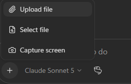

# 🔵 The Greenlight

::: warning 🚧 Work in progress
Scenario 2 is still being built and tested. Steps, downloads, and screenshots may change before the event.
:::
**You'll build this in Microsoft Scout, with GitHub Copilot CLI running the council behind a live dashboard. Scout does the building — you won't hand-write the app.**

You run the council, then turn it into something you can watch.

## What you're solving

One review is not enough when different audiences need different things from the same content. A formal explainer might help a compliance officer make a careful decision and still be unusable for a store manager who needs one practical action during a busy shift.

A single reviewer pictures one average reader and misses that gap. Here you seat a council of audiences, review the same content from each point of view, and put the whole room on a live board so the disagreement is something you can see.

## What you'll walk out with

| What you make | What it does |
| --- | --- |
| **Your council** | Two or more audiences and what each one needs, in `THE-COUNCIL.md`. |
| **A review** | Shows what each audience thinks, with a quote, a source, and a confidence. |
| **A live dashboard** | Each seat lights up with its verdict as you feed the board content. |
| **A one-step run** | A simple way to start the board — a command or a scheduled task. |

The solo critic stays unchanged — the one-verdict "before" you compare against.

## Before you start

Download both and keep them side by side.

	<a class="lab-card" href="/Team-Week-Imagineer-Hack/downloads/the-greenlight.zip" download>
		🔵
		Greenlight skill
		The council method and the unchanged solo-critic baseline.
		Download .zip →
	</a>
	<a class="lab-card" href="/Team-Week-Imagineer-Hack/downloads/greenlight-data-pack.zip" download>
		🗂️
		Content pack
		Five articles, four audience profiles, and a style guide. Use it instead of real work data.
		Download .zip →
	</a>

Open Microsoft Scout and add the Greenlight skill. The dashboard step later also uses **GitHub Copilot CLI** and **Node** — Scout installs what the app needs, but the CLI has to be signed in and working.

---

## 1 · Import the skill, seat your members, and convene the council

1. Extract `the-greenlight.zip` skill to a folder.
1. Add `the-greenlight` skill to Scout by going to **Extensions** and select **Import**
1. Drag the extracted skill **folder** into Scout:
   
1. Start a new chat in Scout and upload **data-pack.zip**.
   <!--  -->

## 2 · Seat the council

Add at least two audiences to `THE-COUNCIL.md` — the provided profiles (start with **Retail** and **Compliance**) or custom audiences you actually care about. They need different goals, or the room can't disagree.

Ask Scout something like, *"Use Greenlight to seat all audiences in the data pack to the council."*

::: tip Use a real audience when it helps
Work IQ can draft a profile from work information you already have access to. Treat it as a first draft and correct it with people who know that audience.
:::

## 3 · Convene the council

Before any dashboard, ask Scout to run the council on the **executive summary (P4)**. You should see the seats split — Retail and Compliance reaching different verdicts, each with a quote, a source, and a confidence.

Do this first on purpose: the core result is done here, with nothing to install. The dashboard makes it visible — it doesn't replace it.

| Piece | Solo critic | Council |
|---|---|---|
| **Executive summary (P4)** | Needs work (one verdict) | **Reject for Retail · Ship for Compliance** |

> **Do not change the solo critic.** It is the "before" you compare your council against.

**Done when:** two seats return different verdicts on P4, each with a quote.

## 4 · Build the dashboard

Now make the disagreement visible. Ask Scout to build a local web dashboard for the council, using **GitHub Copilot CLI as the backend** that runs the Greenlight skill.

Describe what you want:

- a card for each seat that lights up with its verdict — green for ship, amber for revise, red for reject
- the quote and confidence behind each seat's call, on its card
- a place to drop in a document or paste a link for the council to review
- the conflicts and who's served, at a glance

Scout scaffolds the app and wires it to the Copilot CLI backend. When you feed the board a piece, the CLI runs the council and the cards update.

::: warning If the app won't start
Setups vary — Node versions, dependencies, CLI sign-in. If the dashboard won't run on your machine, keep going in the Scout conversation; the council still works there. Get the board up if you can, but don't let it block the review.
:::

**Done when:** you feed the dashboard a piece and watch the seats light up with their verdicts.

## 5 · Make it easy to run

Turn the dashboard into something you start in one step, so a teammate can open the board without wiring it up again. Ask Scout for either:

- a single **start command** — install once, then one command boots the server and opens the browser, or
- a **scheduled task** that launches it so the board is always there.

::: tip Unsure how? Ask Scout!
Ask Scout what the right option is for your situation. One solution doesn't fit everyone's needs, much like the different audiences in this exercise. Ironic, don't you think?
:::

**Done when:** you (or a teammate) can start the board in one step and drop in new content.

## Go further — the bonus

Once the board runs, the bonus is adding features to it. Keep each one small and let Scout build it:

- drag a document or paste a link straight onto the board to convene without the conversation
- a coverage view — every article by every audience, at a glance
- a history, so you can watch a piece improve after a rebuild
- a button that sends the greenlit plan to a person

---

## Show it off

60–90 seconds. Show:

- [ ] The two audiences you seated and the goal each one defends
- [ ] P4 splitting the council in the conversation, each seat with a quote
- [ ] The dashboard lighting up each seat's verdict on a piece you feed it
- [ ] One conflict and the coverage, visible at a glance
- [ ] The board started in one step — a command or a schedule
- [ ] Any feature you added to the board in the bonus round

::: tip What to aim for in the demo
Drop one piece into the board and let two seats disagree in real time. That is the thing a single generic review can never show.
:::

## Stuck?

| What you're seeing | What to do |
| --- | --- |
| Scout ignores the skill | Start a new session — skills load at the start. |
| Both seats give the same verdict | Give them different goals and make their needs specific. |
| The dashboard won't start | Check that GitHub Copilot CLI is signed in and Node is available; meanwhile, convene in the Scout conversation. |
| The board shows nothing back | Confirm the skill is imported and the CLI can run it on its own first. |
| The council can't see the article | Give Scout the content pack, and point the board at the same files. |

---

[← Back to start](/) · [What this scenario is about](/scenarios/scenario-2)
