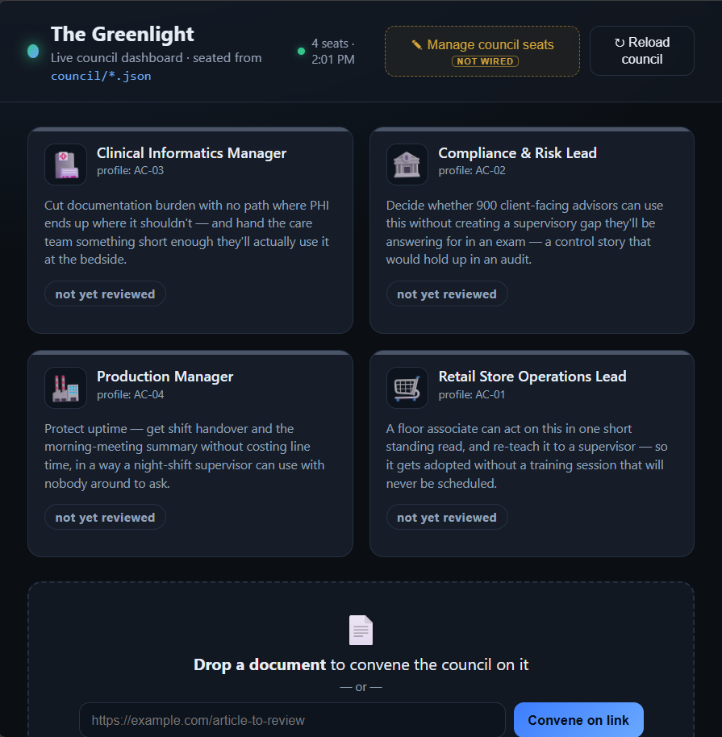

# 🟣 The Greenlight

::: warning 🚧 Work in progress
Scenario 2 is still being built and tested. Steps, downloads, and screenshots may change before the event.
:::
**You'll build this in code – VS Code, GitHub Copilot, and the Copilot CLI.**


You start from a working council dashboard. You make it yours, prove the code catches what the model can't, then pick a path to take it further.



## What you're solving

A single review from a single perspective is not enough when different audiences need so many different things from the same **asset** – a doc, a deck, an email, a policy, a post, a plan. A formal explainer might help a compliance officer make a careful decision and still be unusable for a store manager who needs one practical action during a busy shift.

This altitude solves a second problem too: a model is good at contextual judgment, but it can also make things up. Your council pairs both – the model explains whether an asset works for an audience, and code checks what is countable, so a hallucinated verdict gets caught.

## What your team will have built

| Piece | What it does |
| --- | --- |
| **The board** (provided) | A live dashboard: drop an asset, every seated audience reviews it, and a plan reconvenes until every audience is served. |
| **Your council** | Your real audiences as `council/*.json` – the room reviewing your asset. |
| **The checks** | Deterministic checks (`checks.py`) shown next to each verdict – code catching what the model might wave through. |
| **Your path** | Either a **live seat editor** on the board, or a **PR submission** that ships the greenlit plan for approval. |

## How this runs

You start from a working board and make it yours. This is the contract, not a click-path – the board marks every build path, and Copilot Chat builds each one with you.

| | Step | You're done when |
| --- | --- | --- |
| **1** | **Start the board** | `http://localhost:4173` is up and the Copilot CLI is signed in. |
| **2** | **Convene & watch it split** | The same asset draws opposite, quote-backed verdicts – no code yet. |
| **3** | **Seat an audience that bites** | Your own seat returns a different verdict than another on the same asset. |
| **4** | **Wire a deterministic check** | A code-caught FAIL sits next to a model verdict. |
| **5** | **Pick a path** | You ship it further – a live seat editor (A) or a governed PR (B). |

The **MCP bonus** is there for teams who want the council callable from other agents.

## Before you start

Download all three and unzip them into one folder. Keep `the-greenlight-starter`, `the-greenlight`, and `data-pack` **side by side**.

<div class="lab-grid lab-grid-3">
	<a class="lab-card" href="/AI-Flight-Academy/downloads/the-greenlight-starter.zip" download>
		<span class="lab-card-emoji">📦</span>
		<span class="lab-card-title">Starter repo</span>
		<span class="lab-card-desc">The dashboard, a seated council, the checks, and the MCP server – with the build paths left as TODOs.</span>
		<span class="lab-card-cta">Download .zip →</span>
	</a>
	<a class="lab-card" href="/AI-Flight-Academy/downloads/the-greenlight.zip" download>
		<span class="lab-card-emoji">🟢</span>
		<span class="lab-card-title">Greenlight skill</span>
		<span class="lab-card-desc">The audience-review method and the unchanged solo-critic baseline.</span>
		<span class="lab-card-cta">Download .zip →</span>
	</a>
	<a class="lab-card" href="/AI-Flight-Academy/downloads/greenlight-data-pack.zip" download>
		<span class="lab-card-emoji">🗂️</span>
		<span class="lab-card-title">Content pack</span>
		<span class="lab-card-desc">Five articles, four audience profiles, and a style guide. Use it instead of real work data.</span>
		<span class="lab-card-cta">Download .zip →</span>
	</a>
</div>

You'll need three tools installed. On Windows the fastest way is `winget` from a privileged (Administrator) terminal:

```powershell
winget install OpenJS.NodeJS.LTS     # Node — runs the board
winget install Python.Python.3.12    # Python 3 — runs the checks
# reopen your terminal so Node is on PATH, then:
npm install -g @github/copilot       # GitHub Copilot CLI — the board calls it
```

Prefer installers? Grab [Node.js](https://nodejs.org/), [Python 3](https://www.python.org/downloads/), and the [GitHub Copilot CLI](https://www.npmjs.com/package/@github/copilot). Then run `copilot` once and sign in.

**Node** is required to start the board; **Python 3** is only needed once you wire the checks in Step 4 (until then the board runs and the checks show "not wired"). Open the **the-greenlight-starter** project in VS Code.

---

## The starting point

Now that you have the project downloaded, it's time to get started on the build.

::: tip The board points out what to build
Anywhere the board shows an amber **“not wired”** marker – the checks column, **Submit to hack repo**, and **Manage council seats** – that's a build path. The two buttons even offer a **📋 Copy prompt for Copilot Chat** that hands you a ready-made prompt to build the feature.
:::

### 1 · Start the board

Open a terminal and navigate to the folder where you extracted your zip files.

```powershell
cd the-greenlight-starter/dashboard
npm install
npm start
```

Open `http://localhost:4173`. The startup line confirms your Copilot CLI is found and signed in. If it isn't, install it and sign in, then restart.

**Done when:** the board is up and the startup line confirms the Copilot CLI is signed in.

### 2 · Convene the council

Drop the executive summary (`data-pack/content/P4-exec-summary.md`) onto the board. A single general-purpose reviewer – the **solo critic**, whose scores ship recorded in the pack – could only call this one flat *REVISE*. Your council splits it instead: Retail rejects it outright as an unusable wall of prose, while Compliance ships it – that same control detail is exactly the audit rigor they need. Each verdict comes with a quote and a confidence. Iterate on a remediation plan until the whole council greenlights it, then copy your plan to work on later.

No code yet – one flat verdict becomes a room that disagrees.

**Done when:** the same asset draws opposite verdicts from two seats, each with a quote.

### 3 · Seat an audience that bites

A **seat** is one audience. It says who they are, what they need out of the asset, and the specific bars it has to clear *for them*. Each seat is a small file in the `council/` folder, and four samples already ship.

Add one for an audience *you* write for. The whole trick is the bars: write ones that matter to **your** audience but not to everyone – that's what makes your seat *disagree* with another on the same asset. (A bar any reader would pass is just "good writing," and the solo critic already covers that.)

You don't have to hand-write the file. Open something that knows you – **Copilot**, **Cowork**, or **Scout** – point it at the sample `council/retail.example.json`, and ask:

> Create `my-audience.json` for _[your audience]_, in the same shape as `retail.example.json`: an outcome and two bars, with one marked as a dealbreaker.

When you read what it makes, three things matter:

- The **outcome** is what this reader needs the asset to *do* for them.
- The **bars** protect that outcome. Mark one as a **dealbreaker** – flunk it and the asset is a Reject, however it scores elsewhere.
- Each bar spells out what a failing example versus a great one looks like, so anyone would score it the same way.

Save it in `council/` under a new name (reusing an existing name overwrites that seat), then hit **Reload council** on the board.

**Done when:** your seat lands a different verdict than another seat on the same asset.


### 4 · Wire the deterministic checks

Your council's verdicts come from the model – sharp on judgment, but it can also make things up. **Deterministic checks are the countable half**: reading time, blocked steps, table width – things *code* can measure exactly. Turning them on puts a plain pass/fail on each seat, right beside the model's verdict, so a confident-but-wrong "looks fine" gets caught.

Two small jobs – and you **don't write either from scratch**. The starter leaves both half-built with notes right in the files, and GitHub Copilot Chat can see all of them. Your job is to decide *what each check should measure*; let Copilot write the code with you.

1. **Turn the checks on.** One starter file (`check_content.py`) connects the checks to the board, and it's left unfinished – which is why the board says "not wired." Open it: the note at the top of the file explains, in plain English, exactly what it needs to hand back. Point Copilot Chat at that file and have it finish the connection.

1. **Add a check of your own.** A check is just a small rule – for example, *"fail if the asset takes longer to read than the audience's budget."* There's a finished one to copy and a half-finished one to complete (both live in `checks.py`): finish `check_table_width` so it fails any table wider than the limit set on the audience's card. Then switch it on for an audience by adding one line to that audience's file in `council/`:

    ```json
    "checks": [ { "fn": "check_table_width", "args": { "max_cols": 4 } } ]
    ```

Reload the board and your check shows up next to that seat's verdict.

::: tip What's actually expected of you
You do **not** need to be a Python developer. The starter and Copilot Chat write the code – you decide *what* each check should measure and confirm it fires. You're done when the checks column stops saying "not wired" and at least one check is your own.
:::

**Done when:** you drop an asset and a code-caught **FAIL** shows next to a model verdict.

---

## Pick a path

You've got a working, checked council seated with your own audiences. Now take it further. **Completing either path – A or B – is your finish line.**

- **Path A is front-end** (a UI in the browser – JS and a little Node).
- **Path B is back-end** (Node, git, and the `gh` CLI). Both are scaffolded, and the board hands you a one-click Copilot prompt for each.

Pick the one that matches how you like to build; the bonus is for teams who want to push further.

<PathChooser
  a-emoji="🪑"
  a-title="Path A · Edit the council from the board"
  a-desc="Build a seat editor in the browser – add, edit, and remove audiences live, no hand-editing JSON. Front-end (JS + a little Node)."
  b-emoji="🏁"
  b-title="Path B · Ship it as a PR"
  b-desc="Turn a greenlit plan into a governed pull request into the hack submission repo. The council proposes; a human approves. Back-end (Node, git, gh)."
>

<template #pathA>

### Path A – edit the council from the board

Right now, seating an audience means hand-editing `council/*.json`. This path builds a small **seat editor** into the board so anyone can add, edit, and remove audiences live.

There are two pieces. The **endpoints** are the small part – sanitize the id, then write (or delete) the seat file:

```js
// dashboard/server.js — POST /api/council/seat (stubbed)
const id = String(req.body.seat_id).replace(/[^a-z0-9-_]/gi, "");   // stay inside the folder
fs.writeFileSync(path.join(COUNCIL_DIR, `${id}.json`), JSON.stringify(req.body, null, 2));
```

The **editor UI** is the real work – a form for the seat shape (outcome, thresholds, a list of criteria) that POSTs to those endpoints. Don't hand-build it: click **✎ Manage council seats** on the board for a one-click Copilot prompt that scaffolds the whole dialog, then reload.

**Done when:** you add a new audience from the browser and it reviews the next piece.

</template>

<template #pathB>

### Path B – ship the plan as a pull request

A greenlit plan should land somewhere real. This path wires the board's **🏁 Submit** button to open a pull request into the hack submission repo – the council proposes, a human approves (never auto-merge).

A green plan already holds the drafted assets and a coverage summary; assemble them and open the PR with `gh`:

```js
// dashboard/server.js — POST /api/plan/:planId/submit (stubbed)
const assets = plan.items.filter(i => i.status === "make_new");   // the drafted replacements
// ...write each asset to a branch, use composePlanMarkdown(plan) as the PR body...
spawn(GH_BIN, ["pr", "create", "--repo", SUBMISSION_REPO, "--base", SUBMISSION_BASE,
               "--title", title, "--body-file", bodyPath]);
```

`SUBMISSION_REPO` is a placeholder – keep it safe: only push when a real repo is configured, otherwise write the ready-to-push bundle. Click **🏁 Submit** on a green plan for a one-click Copilot prompt to build it.

**Done when:** a green plan opens a PR (or writes the bundle) into the submission repo, with the coverage summary as the description.

</template>

</PathChooser>

---

## Bonus – make the council callable by other agents (MCP)

The board is one surface. An **MCP server** exposes the council as tools so your *other* agents – Cowork, Scout, a VS Code chat agent – can convene it too. The starter ships `mcp_server.py` with the thin tools (`list_council`, `run_checks`, `solo_baseline`) already working and two left as TODOs.

- **Run it:** `python mcp_server.py` (stdio) or `python mcp_server.py --http`, then call `list_council` / `run_checks` from an MCP client to prove the plumbing with no model needed.
- **Implement `convene(content_path)`** (score every seat) and **`greenlight(review)`** (plan, then re-score) – the tips point to the same Copilot-CLI pattern the board uses in `dashboard/server.js`.
- **Wire it into Cowork or Scout** and convene your council from *another* agent.


## Stuck?

| What you're seeing | What to do |
| --- | --- |
| The board won't start | Check Node is installed and run `npm install` in `dashboard/` first. |
| Startup says the CLI is missing | Install the GitHub Copilot CLI and sign in, then restart the server. |
| The board can't find the council | Keep `the-greenlight-starter`, `the-greenlight`, and `data-pack` side by side. |
| Every audience gets the same result | Make the audience criteria more specific to their outcomes. |
| Seats show “code checks · not wired” | Expected until you implement `check_content.py` – that wires the deterministic checks onto each verdict. |
| Copilot asks too many approvals | Use `--allow-all-tools` only in your own exercise repo. |

::: details 🎬 Nobody nails it first try


First wiring rarely compiles. Errors aren't the end – read the trace, fix a seat, run it again. Shipping is just the last retry that worked.
:::

---

[← Back to start](/) · [What this scenario is about](/scenarios/scenario-2)

