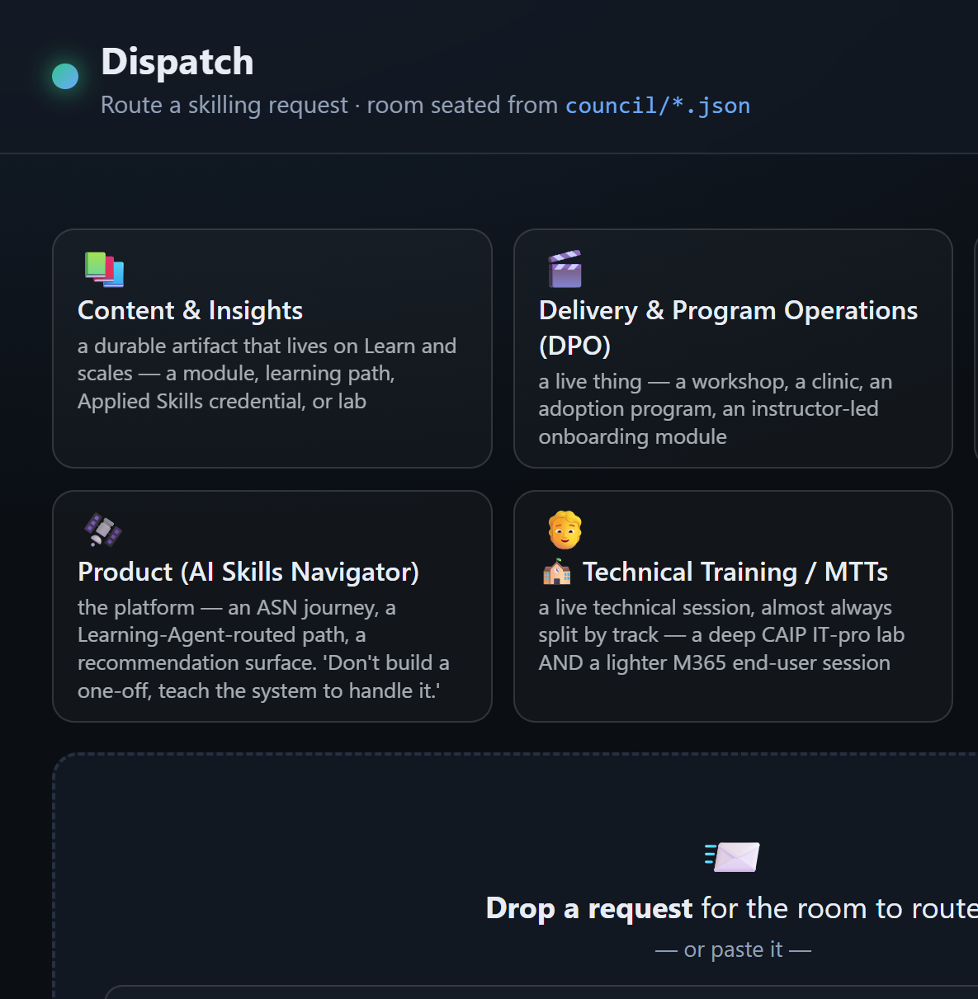

# 🟣 Dispatch

::: warning 🚧 Work in progress
Scenario 2 is still being built and tested. Steps, downloads, and screenshots may change before the event.
:::
**You'll build this in code – VS Code, GitHub Copilot, and the Copilot CLI.**


You start from a working routing dashboard. You make it yours, prove the code catches an under-specified request the model might route anyway, then pick a path to take it further.



## What you're solving

One triager isn't enough when the same skilling request means different work to different teams — and one team's deliverable is another team's reuse. A governance-before-GA ask is an evergreen path, a live workshop, and a partner activation all at once; the plan is to build it once and reuse it.

This altitude solves a second problem too: a model is good at contextual judgement, but it can also route a request that isn't ready. Your room pairs both — the model reasons out each team's position, and code checks what's countable, so a rough idea gets flagged **"sharpen first"** instead of confidently routed.

## What your team will have built

| Piece | What it does |
| --- | --- |
| **The board** (provided) | A live dashboard: drop a request, every seated team takes a position, and the room lands one routing decision. |
| **Your room** | Your real teams as `council/*.json` – the room routing your request. |
| **The intake gate** | A deterministic check (`check_content.py`) that says whether a request is routable before the room decides. |
| **Your path** | Either a **live seat editor** on the board, or **acting on the decision** — wiring it to a real next step. |

## How this runs

You start from a working board and make it yours. This is the contract, not a click-path – the board marks every build path, and Copilot Chat builds each one with you.

| | Step | You're done when |
| --- | --- | --- |
| **1** | **Start the board** | `http://localhost:4173` is up and the Copilot CLI is signed in. |
| **2** | **Dispatch & watch it split** | The same request draws different, charter-backed positions — no code yet. |
| **3** | **Seat a team that splits** | Your own team lands a different position than another on the same request. |
| **4** | **Wire the intake gate** | A rough idea gets flagged "sharpen first" before the room routes it. |
| **5** | **Pick a path** | You ship it further – a live seat editor (A) or acting on the decision (B). |

The **MCP bonus** is there for teams who want the room callable from other agents.

## Before you start

Download all three and unzip them into one folder. Keep `the-dispatch-starter`, `the-dispatch`, and `dispatch-data` **side by side**.

<div class="lab-grid lab-grid-3">
	<a class="lab-card" href="/AI-Flight-Academy/downloads/the-dispatch-starter.zip" download>
		<span class="lab-card-emoji">📦</span>
		<span class="lab-card-title">Starter repo</span>
		<span class="lab-card-desc">The dashboard, a seated room, the intake gate, and the MCP server – with the build paths left as TODOs.</span>
		<span class="lab-card-cta">Download .zip →</span>
	</a>
	<a class="lab-card" href="/AI-Flight-Academy/downloads/the-dispatch.zip" download>
		<span class="lab-card-emoji">🟢</span>
		<span class="lab-card-title">Dispatch skill</span>
		<span class="lab-card-desc">The routing method and the unchanged single-triager baseline.</span>
		<span class="lab-card-cta">Download .zip →</span>
	</a>
	<a class="lab-card" href="/AI-Flight-Academy/downloads/dispatch-data-pack.zip" download>
		<span class="lab-card-emoji">🗂️</span>
		<span class="lab-card-title">Data pack</span>
		<span class="lab-card-desc">Sample requests, the Global Skilling team cards, and the routing policy. Use it instead of real work data.</span>
		<span class="lab-card-cta">Download .zip →</span>
	</a>
</div>

You'll need three tools installed. On Windows the fastest way is `winget` from a privileged (Administrator) terminal:

```powershell
winget install OpenJS.NodeJS.LTS     # Node — runs the board
winget install Python.Python.3.12    # Python 3 — runs the intake gate
# reopen your terminal so Node is on PATH, then:
npm install -g @github/copilot       # GitHub Copilot CLI — the board calls it
```

Prefer installers? Grab [Node.js](https://nodejs.org/), [Python 3](https://www.python.org/downloads/), and the [GitHub Copilot CLI](https://www.npmjs.com/package/@github/copilot). Then run `copilot` once and sign in.

**Node** is required to start the board; **Python 3** is only needed once you wire the intake gate in Step 4 (until then the board runs and the gate shows "not built"). Open the **the-dispatch-starter** project in VS Code.

---

## The starting point

Now that you have the project downloaded, it's time to get started on the build.

::: tip The board points out what to build
Anywhere the board shows an amber **"not wired"** marker – the intake badge and **Act on this decision** – that's a build path. The runs use a pinned, cost-predictable model (`claude-sonnet-4.6`); change it with `DISPATCH_MODEL` if you like.
:::

### 1 · Start the board

Open a terminal and navigate to the folder where you extracted your zip files.

```powershell
cd the-dispatch-starter/dashboard
npm install
npm start
```

Open `http://localhost:4173`. The startup line confirms your Copilot CLI is found and signed in. If it isn't, install it and sign in, then restart.

**Done when:** the board is up and the startup line confirms the Copilot CLI is signed in.

### 2 · Dispatch a request

Drop or paste a request (`dispatch-data/requests/RQ-01-agent-governance-before-ga.md`) onto the board. A single triager — whose one-owner decisions ship recorded in the pack — could only say *"send it to Content & Insights."* Your room agrees on the owner but **splits on the plan**: C&I builds the governance path once, Delivery reuses it live, Field & Partner reuses it regionally, and the real first audience is partners. Each position is grounded in a team's charter.

No code yet – one owner becomes a plan with reuse.

**Done when:** the same request draws different positions from the teams, each charter-backed.

### 3 · Seat a team that splits

A **seat** is one team. It says what it owns, who it serves, and what makes it want a request or pass it on. Each seat is a small file in the `council/` folder, and five teams already ship.

Add one for a team *you* work with. The whole trick is the charter: give it a different instinct than the others — a different audience, a different format bias — so it *disagrees* about the plan. (A team that would route everything the same way as another is a duplicate.)

You don't have to hand-write the file. Open something that knows you – **Copilot**, **Cowork**, or **Scout** – point it at the sample `council/team.example.json`, and ask:

> Create `my-team.json` for _[your team]_, in the same shape as `team.example.json`: what it owns, who it serves, what makes it say yes or no, and its format bias.

When you read what it makes, three things matter:

- **owns / serves** is what makes a request theirs.
- **says_yes_when / says_no_when** is the instinct that makes it want a request or pass — this is what splits the room.
- **format_bias** is the shape it pushes work into — often the deliverable it wants in the plan.

Save it in `council/` under a new name (reusing an existing name overwrites that seat), then hit **Reload room** on the board.

**Done when:** your team lands a different position than another team on the same request.


### 4 · Wire the intake gate

Your room's positions come from the model – sharp on judgement, but it will happily route a request that isn't ready. **The intake gate is the countable half**: does the request even name an audience, a topic, and an outcome? A rough idea (an `IDEA-…`) shouldn't be confidently routed — it should be *sharpened*. That's a check, not a vibe.

Two small jobs – and you **don't write either from scratch**. The starter leaves the gate half-built with notes right in the file, and GitHub Copilot Chat can see all of it. Your job is to decide *what makes a request routable*; let Copilot write the code with you.

1. **Turn the gate on.** One starter file (`check_content.py`) is left unfinished – which is why the board says the intake gate isn't built. Open it: the note at the top explains, in plain English, exactly what it hands back — `{routable, present, missing, detail}`. `dispatchlib.parse_request` already does the parsing; you decide present vs missing against the required fields. Point Copilot Chat at that file and have it finish the gate.

1. **Add a guardrail of your own.** The gate checks the *request*; a guardrail checks the *decision*. Pick one from `dispatch-data/policy/ROUTING-RULES.md` — for example, *"a credential deliverable needs stable objectives,"* or *"a partner audience must involve Field & Partner"* — and have Copilot add it.

::: tip What's actually expected of you
You do **not** need to be a Python developer. The starter and Copilot Chat write the code – you decide *what makes a request routable* and confirm it fires. You're done when a rough `IDEA-…` gets flagged "sharpen first" and a formed `RQ-…` passes.
:::

**Done when:** you drop a rough idea and the board flags it **"sharpen first"** before the room routes it.

---

## Pick a path

You've got a working room seated with your own teams and an intake gate that won't route a guess. Now take it further. **Completing either path – A or B – is your finish line.**

- **Path A is front-end** (a UI in the browser – JS and a little Node).
- **Path B is back-end** (Node, plus the tracker or channel you route into). Both are clear build paths, and Copilot Chat builds each with you.

Pick the one that matches how you like to build; the bonus is for teams who want to push further.

<PathChooser
  a-emoji="🪑"
  a-title="Path A · Edit the room from the board"
  a-desc="Build a seat editor in the browser – add, edit, and remove teams live, no hand-editing JSON. Front-end (JS + a little Node)."
  b-emoji="📤"
  b-title="Path B · Act on the decision"
  b-desc="Wire the board's Act button to route a decision onward — open a work item, post to a channel, notify the owner. The room proposes; a human approves. Back-end (Node)."
>

<template #pathA>

### Path A – edit the room from the board

Right now, seating a team means hand-editing `council/*.json`. This path builds a small **seat editor** into the board so anyone can add, edit, and remove teams live.

There are two pieces. The **endpoint** is the small part – sanitize the id, then write (or delete) the seat file:

```js
// dashboard/server.js — POST /api/council/seat (you add this)
const id = String(req.body.team_id).replace(/[^a-z0-9-_]/gi, "");   // stay inside the folder
fs.writeFileSync(path.join(COUNCIL_DIR, `${id}.json`), JSON.stringify(req.body, null, 2));
```

The **editor UI** is the real work – a form for the team seat shape (owns, serves, says-yes/says-no, format bias) that POSTs to that endpoint. Point Copilot Chat at `dashboard/public/` and have it scaffold the dialog, then reload.

**Done when:** you add a new team from the browser and it takes a position on the next request.

</template>

<template #pathB>

### Path B – act on the decision

A routing decision should land somewhere real. This path wires the board's **📤 Act on this decision** button (it answers `501` today) to route the decision onward — open a work item for the owner, post it to a channel, or notify the team — the room proposes, a human approves (never auto-act).

The decision is already on the job; assemble it and route it:

```js
// dashboard/server.js — POST /api/dispatch/:id/act (stubbed, returns 501)
const decision = job.result.decision;   // owner, audience, plan[], disposition, next_action
// ...open a work item for decision.owner, or post the decision to a channel...
```

`DISPATCH_ACT_TARGET` is a placeholder – keep it safe: only act when a real target is configured, otherwise write the ready-to-send payload. Click **📤 Act on this decision** for the shape to build against.

**Done when:** a decision opens a work item (or writes the payload) for its owner, with the plan as the body.

</template>

</PathChooser>

---

## Bonus – make the room callable by other agents (MCP)

The board is one surface. An **MCP server** exposes the room as tools so your *other* agents – Cowork, Scout, a VS Code chat agent – can dispatch to it too. The starter ships `mcp_server.py` with the thin tools (`list_room`, `check_routable`, `routing_rules`) already working and `dispatch` left as a TODO.

- **Run it:** `python mcp_server.py` (stdio) or `python mcp_server.py --http`, then call `list_room` / `check_routable` from an MCP client to prove the plumbing with no model needed.
- **Implement `dispatch(request_path)`** – each team takes a position, then the room lands one decision. The tips point to the same Copilot-CLI pattern the board uses in `dashboard/server.js`.
- **Wire it into Cowork or Scout** and dispatch a request from *another* agent.


## Stuck?

| What you're seeing | What to do |
| --- | --- |
| The board won't start | Check Node is installed and run `npm install` in `dashboard/` first. |
| Startup says the CLI is missing | Install the GitHub Copilot CLI and sign in, then restart the server. |
| The board can't find the room | Keep `the-dispatch-starter`, `the-dispatch`, and `dispatch-data` side by side. |
| Every team gives the same position | Make the team charters more distinct. |
| The intake badge says "not built" | Expected until you implement `check_content.py` – that wires the routable check onto the board. |
| Copilot asks too many approvals | Use `--allow-all-tools` only in your own exercise repo. |

::: details 🎬 Nobody nails it first try


First wiring rarely compiles. Errors aren't the end – read the trace, fix a seat, run it again. Shipping is just the last retry that worked.
:::

---

[← Back to start](/) · [What this scenario is about](/scenarios/scenario-2)
