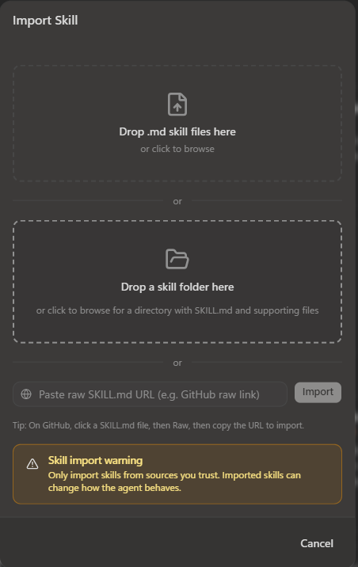

# 🔵 Dispatch

::: warning 🚧 Work in progress
Scenario 2 is still being built and tested. Steps, downloads, and screenshots may change before the event.
:::
**You'll build this in Microsoft Scout, with GitHub Copilot CLI running the room behind a live dashboard. Scout does the building – you won't hand-write the app.**

You run the room, then turn it into something you can watch.

## What you're solving

One triager isn't enough when the same skilling request means different work to different teams. A governance-before-GA ask is an evergreen learning path to one team, a live workshop to another, and a partner-first activation to a third — and one of those deliverables should be built once and reused by the others.

A single triager picks one owner and misses all of that. Here you seat a room of teams, dispatch the same request to each, and put the whole room on a live board so the plan — and the reuse — is something you can see.

## What you'll walk out with

| What you make | What it does |
| --- | --- |
| **Your room** | Three or more teams and what each one wants, in `THE-ROOM.md`. |
| **A dispatch** | Each team's position on the same request, grounded in its charter. |
| **A live dashboard** | Each team lights up with its position, and the room lands one decision. |
| **A one-step run** | A simple way to start the board – a command or a scheduled task. |

The single triager stays unchanged – the one-owner "before" you compare against.

## How this runs

Four steps. The first two are quick; the board is the build.

| | Step | You're done when |
| --- | --- | --- |
| **1** | **Import & load** | Scout has the Dispatch skill and the data pack loaded. |
| **2** | **Seat a room that splits** | Three teams return *different* positions on the same request – proven in conversation, nothing built yet. |
| **3** | **Put the room on a board** | You drop a request on a live dashboard and the teams light up with their positions. |
| **4** | **Make it one-step to run** | You can start the board with one command or a schedule. |

**Step 2 you do as a table** – each person seats one team, then you combine them into one room. Steps 3–4 are the build.

Every step gives you a line you can paste. **Change it – it's a starting point, not the answer.**

## Before you start

Download both and keep them side by side.

	<a class="lab-card" href="/AI-Flight-Academy/downloads/the-dispatch.zip" download>
		🔵
		Dispatch skill
		The room method and the unchanged single-triager baseline.
		Download .zip →
	</a>
	<a class="lab-card" href="/AI-Flight-Academy/downloads/dispatch-data-pack.zip" download>
		🗂️
		Data pack
		Sample requests, the Global Skilling team cards, and the routing policy. Use it instead of real work data.
		Download .zip →
	</a>

Open Microsoft Scout and add the Dispatch skill. The dashboard step later also uses **GitHub Copilot CLI** and **Node** – Scout installs what the app needs, but the CLI has to be signed in and working.

---

## 1 · Import & load

**Done when:** Scout has the Dispatch skill and the data pack loaded.

1. Extract `the-dispatch.zip` and, in Scout, go to **Extensions → Import** and drag the extracted skill **folder** in.

   
1. Start a new chat in Scout and upload **dispatch-data-pack.zip**.

## 2 · Seat a room that splits

**Done when:** three teams return *different* positions on the same request – proven in conversation, with nothing built yet.

A **seat** is one team – what it owns, who it serves, and what makes it want a request or pass it on. The goal isn't to *list* teams – it's to seat ones that **disagree about the plan**: a team that would route everything the same way as another is a duplicate.

As a table, each person seats one team – start with **Content & Insights**, **Delivery & Program Operations**, and **Field & Partner**, the sharpest trio – then combine them into one `THE-ROOM.md`. Ask Scout to seat them, then dispatch **RQ-01**, the request chosen to prove the point:

> *"Use Dispatch to seat Content & Insights, Delivery & Program Operations, and Field & Partner from the data pack, then dispatch RQ-01 (agent governance before GA)."*

**Dispatching** is the heart of it: every team takes a position on the same request at once — grounded in its charter — and the room lands one decision. RQ-01 is exactly the case where the room *agrees who owns it* (Content & Insights) but *splits on the plan*: build the path once and reuse it live and regionally, and repoint the audience to partners-first.

| Request | Single triager | The room |
|---|---|---|
| **Governance before GA (RQ-01)** | Send it to Content & Insights | **C&I builds the path once · DPO & Field & Partner reuse it · audience repointed to partners-first** |

That split – same request, one owner but three reuses, each charter-backed – *is* the result of this step. The thinking is done here, with nothing installed; everything after just makes it visible and repeatable.

::: tip Seat a real team with Work IQ
Scout is grounded in your Microsoft 365 work through **Work IQ** – it only ever sees what you already can. Ask it to draft a team's charter from those real signals – *"Scout, draft a team card for [a team you work with] from Work IQ that mimics the cards in THE-ROOM.md"* – then correct it with people who know that team. Treat it as a first draft, not the answer.
:::

## 3 · Put the room on a board

Now make the plan visible. Ask Scout to build a local web dashboard for the room, using **GitHub Copilot CLI as the backend** that runs the Dispatch skill.

Describe what you want:

- a card for each team that shows its position — in, support, or out — as you dispatch a request
- the deliverable and reuse each team proposes, on its card
- a place to drop in a request or paste a rough idea
- the final routing decision — owner, audience, and the build-once/reuse plan — at a glance
- a creative theme for the room or a custom name

Scout scaffolds the app and wires it to the Copilot CLI backend. When you feed the board a request, the CLI runs the room and the cards update.

::: details Stuck on the prompt? Start with this
Paste this into Scout, then adjust from there:

> Build me a local web dashboard for the Dispatch room. Use **GitHub Copilot CLI as the backend** to run the Dispatch skill: a small **Node** web server that shells out to `copilot`, with a plain HTML/CSS/JS front-end – no build step, minimal dependencies, so it starts with one command. Show a card for each team in `THE-ROOM.md` with its position (in / support / out), its proposed deliverable, and any reuse. Add a place to drop a request or paste a rough idea, and a panel for the final routing decision — owner, audience, and the plan of deliverables with who builds and who reuses. Start simple – I'll ask for more.

The real trick is to **start small and layer on**: get the team cards showing positions on one request first, then ask for one addition at a time (the decision panel, a reuse map, a theme) instead of everything in a single prompt.
:::

::: warning If the app won't start
Setups vary – Node versions, dependencies, CLI sign-in. If the dashboard won't run on your machine, keep going in the Scout conversation; the room still works there. Get the board up if you can, but don't let it block the dispatch.
:::

**Done when:** you feed the dashboard a request and watch the teams light up with their positions.

## 4 · Make it one-step to run

Turn the dashboard into something you start in one step, so a teammate can open the board without wiring it up again. Ask Scout for either:

- a single **start command** – install once, then one command boots the server and opens the browser, or
- a **scheduled task** that launches it so the board is always there.

::: tip Unsure how? Ask Scout!
Ask Scout what the right option is for your situation. One solution doesn't fit everyone — much like the different teams in this exercise. Ironic, don't you think?
:::

**Done when:** you (or a teammate) can start the board in one step and drop in a new request.

## Go further – the bonus

Once the board runs, the bonus is adding features to it. Keep each one small and let Scout build it:

- an **intake gate** badge — flag a rough idea as "sharpen first" before the room routes it
- a **reuse map** — draw the build-once deliverable fanning out to the teams that reuse it
- a history, so you can watch a request get sharpened and re-dispatched
- a button that opens a work item for the decision's owner
- animations for when the room is deliberating

---

## Stuck?

| What you're seeing | What to do |
| --- | --- |
| Scout ignores the skill | Start a new session – skills load at the start. |
| Every team gives the same position | Give them more distinct charters. |
| The dashboard won't start | Check that GitHub Copilot CLI is signed in and Node is available; meanwhile, dispatch in the Scout conversation. |
| The board shows nothing back | Confirm the skill is imported and the CLI can run it on its own first. |
| The room can't see the request | Give Scout the data pack, and point the board at the same files. |

::: details 🎬 Nobody nails it first try

Let Scout off the leash and it might build you forty booths. When it overshoots, rein it in and re-run – steering the agent *is* the build.
:::

---

[← Back to start](/) · [What this scenario is about](/scenarios/scenario-2)
